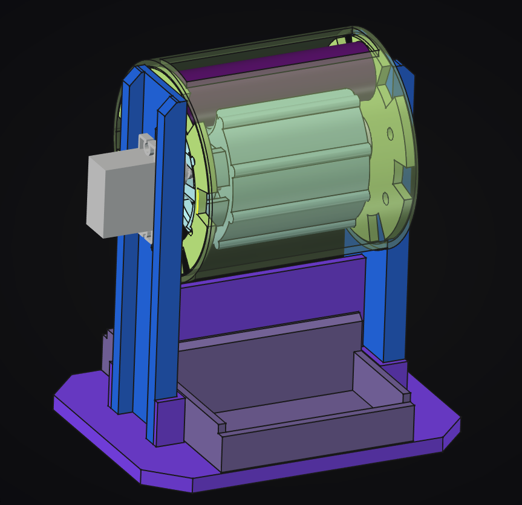

# AutoVolt



An **automatic Li-ion battery charger** that loads empty batteries, charges them, and dispenses charged batteries — a hands-free, automated battery management station.

## About

AutoVolt is an electromechanical device that takes an empty Li-ion cell, charges it to capacity, and dispenses it ready to use. The mechanism automatically feeds empty batteries in, manages the charging cycle, and outputs charged batteries on demand.

## Key Components

- **ESP32** — microcontroller that controls the whole system
- **TP4056 charging modules** — Li-ion charging IC modules for CC/CV charging
- **MG90S micro servo** — drives the battery loading / dispensing mechanism
- **18650 Li-ion cells** — target battery format

## Features

- Automated workflow: load empty battery → charge → dispense charged battery
- Charge management with per-cell voltage monitoring
- Custom mechanical enclosure designed in FreeCAD around the MG90S servo
- Web dashboard planned for monitoring and control

*Feature set is still evolving — this is an early-stage project.*

## Repository Structure

```
AutoVolt/
├── firmware/     → ESP32 firmware source (src/, include/)
├── hardware/     → Electronics: BOM and schematics
├── mechanical/   → Enclosure: FreeCAD CAD, STEP/STL exports, drawings
├── software/     → Host/web software: web/backend and web/frontend
├── config/       → Device and firmware configuration
├── scripts/      → Build / deploy / flash tooling
├── docs/         → Architecture, API docs, datasheets, images
├── LICENSE       → GNU GPL v3
└── README.md
```

## Resources

- [TP4056 datasheet](docs/datasheets/)
- [MG90S datasheet](docs/datasheets/)
- [ESP32 documentation](https://docs.espressif.com/)
- [FreeCAD](https://www.freecad.org/)

## Getting Started

_Documentation for building and running the project is in progress._ Scripts for building and flashing the firmware are prepared in `scripts/`.

## License

This project is licensed under the [GNU GPL v3](LICENSE).
